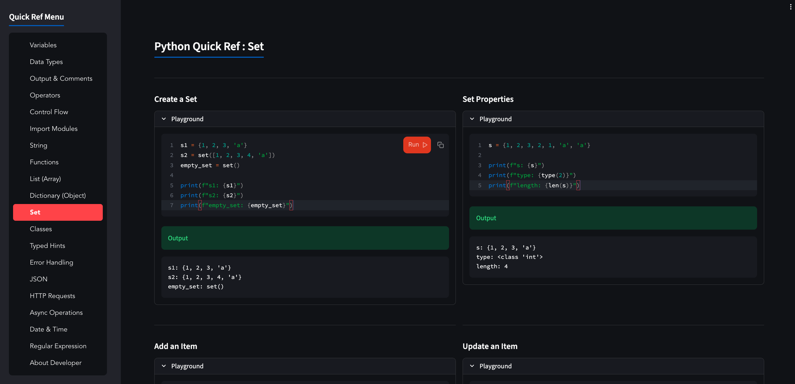

<div align="center">

# 🐍 Python Quick Reference

### A modern interactive Python cheatsheet built with Streamlit

Fast • Beginner Friendly • Interactive • Live Playground

[]()
[]()
[](https://www.apache.org/licenses/LICENSE-2.0)

### 🚀 Live Demo

👉 [using stlite - WASM Build] https://samsol38.github.io/python-cheatsheet/index.html

👉 [using StreamLit] https://py-cheatsheet.streamlit.app/

</div>

---

# 📸 Screenshot

<p align="center">
    
</p>

---

# ✨ Features

- 📖 Beginner-friendly Python quick reference
- ⚡ Interactive code playground
- 🎯 Clean and minimal UI
- 🌙 Dark theme
- 📱 Responsive layout
- 🧩 Organized by topics
- 📚 Practical examples
- 📝 Copy-friendly code snippets
- 🚀 Instant output previews

---

# 📚 Topics Covered

✅ Variables

✅ Data Types

✅ Output & Comments

✅ Operators

✅ Control Flow

✅ Import Modules

✅ String

✅ Function

✅ List (Array)

✅ Dictionary (Object)

✅ Set

✅ Classes

✅ Type Hints

✅ Error Handling

✅ JSON

✅ HTTP Requests

✅ Async Operations

✅ Date & Time

✅ Regular Expression

---

# 🛠 Built With

- Python
- Streamlit
- Streamlist Code Editor
- Requests

---

# 🚀 Run Locally

Clone the repository

```bash
git clone https://github.com/samsol38/python-cheatsheet.git
```

Go to the project directory

```bash
cd python-cheatsheet
```

Install dependencies

```bash
pip install -r requirements.txt
```

Run Streamlit

```bash
streamlit run streamlit_app.py
```

---

# 📂 Project Structure

```
python-quick-reference/
│
├── streamlit_app.py.py
├── requirements.txt
├── assets/
│   └── python-quick-ref.png
└── README.md
```

---

# 🎯 Why This Project?

Learning Python often means jumping between documentation, tutorials and Stack Overflow.

**Python Quick Reference** brings the most commonly used Python syntax into one interactive application where developers can:

- Learn quickly
- Revise concepts
- Experiment with examples
- Copy working snippets
- Improve productivity

Whether you're a beginner or an experienced developer, the app acts as a handy desktop reference while coding.

---

# 🤝 Contributions

Contributions are welcome!

If you have ideas for improvements, new examples, or additional Python topics, feel free to open an issue or submit a pull request.

---

# 📊 Project Information

| Property   | Value                               |
| ---------- | ----------------------------------- |
| Language   | Python                              |
| Framework  | Streamlit                           |
| UI         | Interactive Web App                 |
| Difficulty | Beginner → Intermediate             |
| Purpose    | Python Quick Reference / Cheatsheet |
| License    | Apache                              |

---

# 👨‍💻 Developer

**Samir Solanki**

🌐 Portfolio: https://noto.li/fxHVPg

💼 LinkedIn: https://linkedin.com/in/samir38

---

<div align="center">

### ⭐ If you find this project useful, consider giving it a Star!

Made with ❤️ using Python & Streamlit

</div>
